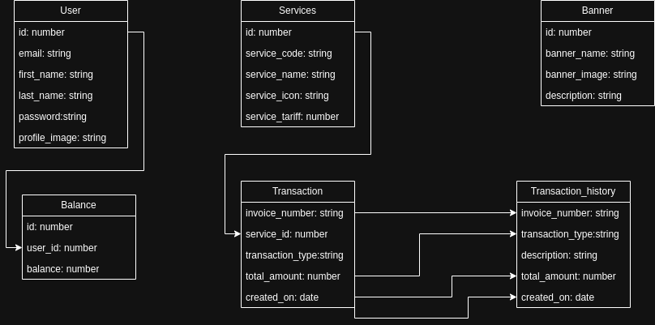
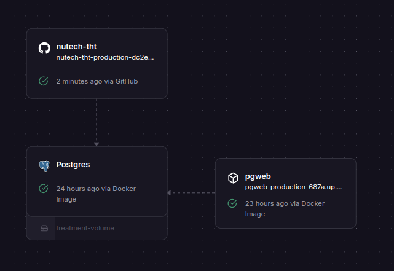

# NuTech Take Home Test REST API

### skema database

link project on [github.com](https://github.com/masprast/nutech-tht)
link deployed: [railway.app](https://nutech-tht-production-dc2e.up.railway.app/)

### berfungsi

1. deployed to railway.app
2. data validation

### kekurangan

1. Swagger belum terkonfigurasi dengan baik, sehingga menampilkan halaman kosong
2. API belum ada yang berjalan dengan baik, dengan kode error 502

#### kendala

laptop bermasalah, hanya menyala selama 30 menit, sehingga hilang daya setiap setengah jam
